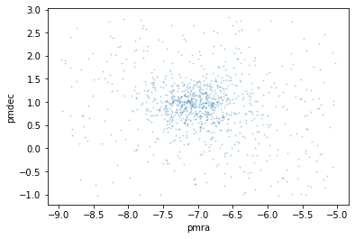
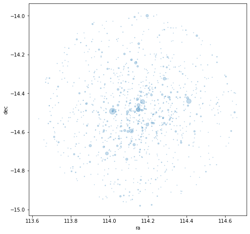
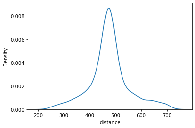
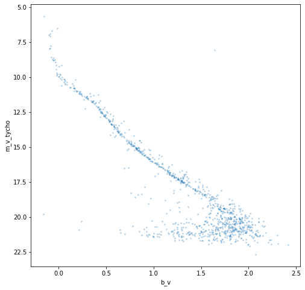

How to conduct a simple name search
===================================

After installing the clusterpluck package, this tutorial demonstrates
how to search for an open cluster using just its name.

First, import the module and classes.

.. code:: ipython3

    import clusterpluck as cp
    from clusterpluck.gaia import Refine, Info, Plotting

.. parsed-literal::

    Created TAP+ (v1.2.1) - Connection:
    	Host: gea.esac.esa.int
    	Use HTTPS: True
    	Port: 443
    	SSL Port: 443
    Created TAP+ (v1.2.1) - Connection:
    	Host: geadata.esac.esa.int
    	Use HTTPS: True
    	Port: 443
    	SSL Port: 443
    

Then, perform the search, downloading the basic cluster data from the
`SIMBAD Astronomical Database <http://simbad.u-strasbg.fr/simbad/>`__
and the individual star data from the `Gaia
archive <https://gea.esac.esa.int/archive/>`__.

The name of the cluster must be in a string and must also be in a
recognised format, i.e. M.. for Messier catalogue, NGC.. for New General
Catalogue, etc. It is possible that lesser known catalogues can be used
but they may cause an error if the format doesn’t match SIMBAD’s.

The results will be downloaded and stored as a CSV file.

.. code:: ipython3

    cluster = cp.search_name('M47')

.. parsed-literal::

    Number of stars: 994
    RA: 07 36 35 Dec: -14 29.0 Rad: 0.5
    PM_RA: -7.02 PM_Dec: 0.9592 PM_Rad: 2
    Distance range: 242 pc to 725 pc
    

Messier 47 is an open cluster in Cancer. The output of the search
contains the following information:

-  The number of stars downloaded from the Gaia database.
-  The right ascention (RA), declination (Dec) and search radius of the
   cluster. This is its position in the sky and it’s size.
-  The proper motion RA, Dec and search radius. This is the rate of
   cluster’s apparent movement across the sky. Cluster stars will all
   share approximately the same apparent movement and so will form a
   tight group when these data are plotted. In fact it is the main
   method used to identify cluster members.
-  Finally, the distance range of the search. This helps filter out lots
   of stars that are unrelated but can also cause cluster stars to be
   lost. In particular any objects further than 1 kpc (1000 pc) away can
   suffer from this.

Any or all of these can be amended by using the general ``search()``
function but that is for another tutorial.

Now let’s create a pandas dataframe from the CSV file. This function
also corrects and adds a few columns.

.. code:: ipython3

    t = Refine.load(cluster)

We can check the dataframe using simple pandas commands.

.. code:: ipython3

    t.info()

.. parsed-literal::

    <class 'pandas.core.frame.DataFrame'>
    RangeIndex: 994 entries, 0 to 993
    Data columns (total 14 columns):
     #   Column           Non-Null Count  Dtype  
    ---  ------           --------------  -----  
     0   parallax         994 non-null    float64
     1   parallax_error   994 non-null    float64
     2   pmra             994 non-null    float64
     3   pmra_error       994 non-null    float64
     4   pmdec            994 non-null    float64
     5   pmdec_error      994 non-null    float64
     6   bp_rp            994 non-null    float64
     7   phot_g_mean_mag  994 non-null    float64
     8   ra               994 non-null    float64
     9   dec              994 non-null    float64
     10  distance         994 non-null    float64
     11  distance_error   994 non-null    float64
     12  m_v_tycho        994 non-null    float64
     13  b_v              994 non-null    float64
    dtypes: float64(14)
    memory usage: 108.8 KB
    

Once the data are loaded to a variable we can check to see if we have a
cluster. Let’s see how the proper motion plot, ``pm_plot()``, looks.

.. code:: ipython3

    Refine.pm_plot(t)

We can see the cluster’s stars are forming a group right in the middle
of the plot! That means SIMBAD has given us good proper motion data and
the default proper motion radius is acceptable. Any closer and we would
lose relevent star data. Further away and there would be mnore chance of
unrelated stars included.

Now let’s look at a plot of the cluster as a star map.

.. code:: ipython3

    Refine.map(t)

This plot shows a star map of the search with the star size proportional
to their magnitude. It can help show us if our search radius is too wide
or narrow. This looks pretty good as the cluster appears fully
contained.

Now let’s see if the distance filter has correct values.

.. code:: ipython3

    Refine.d_plot(t)

There is a very clear, tall peak in the middle of our graph that tells
us the cluster stars are clearly outnumbering the unrelated stars. We
can also see roughly how far away the cluster is in parsecs just by
looking. The distance filter doesn’t need refining either. So that is
all the parameters involved with the search.

However let’s have a look at two of the features we can draw from this
data; a colour magnitude diagram and a more precise measurement of the
distance.

Using the ``Plotting`` class, we can call the ``cmd2()`` function which
uses calculated values of apparent visual magnitude and the standardised
B-V colour index…

.. code:: ipython3

    Plotting.cmd2(t)

… and we have a beautiful CMD plot with the classic *main sequence* of
stars running from top left to bottom right. These stars are in the
middle of their lives, burning Helium in their cores in a relatively
stable way just like our sun. The thin line of stars above running
parallel to it are multiple star systems that have a slightly higher
luminosity.

Other features are the brightest stars at the top which appear to just
be ‘curling’ upwards. This is called the *main sequence turn off*. The
stars here are running low on core Helium and starting to evolve into
*red giants*. They’re not quite at that point but the position of the
turn off is a major method of ageing clusters. At the other end are the
red and white dwarfs.

Finally, use the ``Info`` class ``dist()`` function to extract a precise
calculated distance from the parallax data including a 2-sigma range.
This distance isn’t to be used in a scientific context yet as it simply
uses an inverted parallax method to calculate.

.. code:: ipython3

    Info.dist(t)

.. parsed-literal::

    Distance: 474 pc
    5%: 341 pc - 95%: 633
    

Next, we will look at how to refine the cluster data if name search
doesn’t quite give us what we need.
