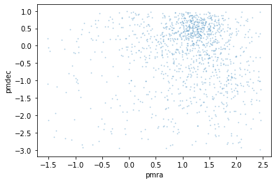
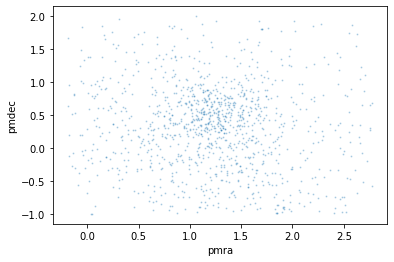
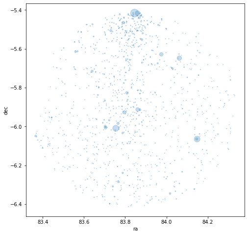
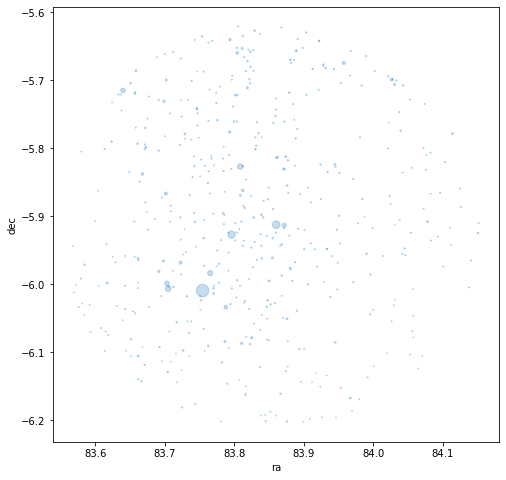
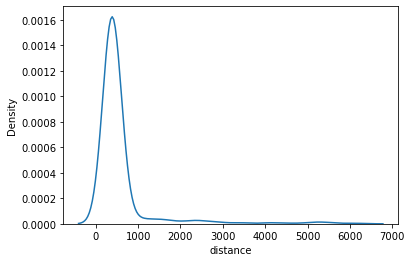
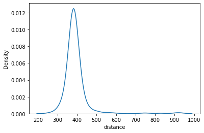
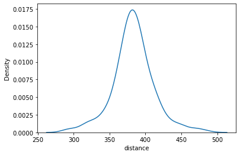
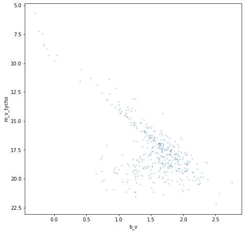

How to refine a search
======================

Sometimes the simple name search won’t bring up exactly what we’re
looking for and the parameters might need some amending.

As always, first import the module/classes.

.. code:: ipython3

    import clusterpluck as cp
    from clusterpluck.gaia import Refine, Info, Plotting

.. parsed-literal::

    Created TAP+ (v1.2.1) - Connection:
    	Host: gea.esac.esa.int
    	Use HTTPS: True
    	Port: 443
    	SSL Port: 443
    Created TAP+ (v1.2.1) - Connection:
    	Host: geadata.esac.esa.int
    	Use HTTPS: True
    	Port: 443
    	SSL Port: 443
    

Let’s do another simple name search and see what we get. NGC1980 is a
young open cluster near the Orion nebula.

.. code:: ipython3

    cluster = cp.search_name('NGC1980')

.. parsed-literal::

    Number of stars: 1226
    RA: 05 35 24 Dec: -05 54.9 Rad: 0.5
    PM_RA: 0.46 PM_Dec: -1.01 PM_Rad: 2
    Distance range: 210 pc to 3146 pc
    

1226 Stars sounds good. Let’s take a look at the proper motion plot.

.. code:: ipython3

    t = Refine.load(cluster)

.. code:: ipython3

    Refine.pm_plot(t)

OK. Well we have a clustering but it’s off to one side. SIMBAD hasn’t
given us proper motion info that matches Gaia’s. We’ll just have to
amend it manually.

Use the ``search()`` function which needs the position supplied in
strings. As we suspect the cluster is being found, *just copy and paste
the RA and Dec from above*. Then it is a case of entering values for the
proper motion filter.

First use the ``pmra`` and ``pmdec`` keywords to define the centre of
the proper motion group. Looking at the plot above we can guess at about
1.3 for the RA and 0.5 for the Dec. A radius of 1.5 should be wide
enough, put this as the ``pm_r`` keyword.

**Sometimes the proper motion lies completely outside of the plot. It’s
worth checking with a much larger ``pm_r`` such as 10 (the default) in
this case.**

.. code:: ipython3

    cluster = cp.search('05 35 24', '-05 54.9', pmra=1.3, pmdec=0.5, pm_r=1.5)

.. parsed-literal::

    Number of stars: 1130
    RA: 05 35 24 Dec: -05 54.9 Rad: 0.5
    PM_RA: 1.3 PM_Dec: 0.5 PM_Rad: 1.5
    Distance range: 1 pc to 10000 pc
    

…and then look at the proper motion again.

.. code:: ipython3

    t = Refine.load(cluster)

.. code:: ipython3

    Refine.pm_plot(t)

Much better. The group is now central and seems well contained in the
plot. Next let’s check the map.

.. code:: ipython3

    Refine.map(t)

Well it appears that the cluster is in the middle of the map but there
appear to be lots of stars around the outside that probably aren’t
cluster members. We need to ‘zoom in’ a little.

Do this by using the search terms above and add in a ``radius`` of 0.3
(the default is 0.5 which looks to be too wide in this case) then load
the table and plot the map again.

.. code:: ipython3

    cluster = cp.search('05 35 24', '-05 54.9', pmra=1.3, pmdec=0.5, pm_r=1.5, radius=0.3)

.. parsed-literal::

    Number of stars: 474
    RA: 05 35 24 Dec: -05 54.9 Rad: 0.3
    PM_RA: 1.3 PM_Dec: 0.5 PM_Rad: 1.5
    Distance range: 1 pc to 10000 pc
    

.. code:: ipython3

    t = Refine.load(cluster)

.. code:: ipython3

    Refine.map(t)

This looks better. Now the distance filter.

.. code:: ipython3

    Refine.d_plot(t)

How annoying! The default ``search()`` distances are more vague and so
can include much more distant stars. Let’s do the search again but add
in a new set of filters, ``d_near`` and ``d_far`` which should be self
explanitory.

.. code:: ipython3

    cluster = cp.search('05 35 24', '-05 54.9', pmra=1.3, pmdec=0.5, pm_r=1.5, radius=0.3, d_near=0, d_far=1000)
    t = Refine.load(cluster)
    Refine.d_plot(t)

.. parsed-literal::

    Number of stars: 436
    RA: 05 35 24 Dec: -05 54.9 Rad: 0.3
    PM_RA: 1.3 PM_Dec: 0.5 PM_Rad: 1.5
    Distance range: 1 pc to 1000 pc
    

Getting warmer. The distance filter normally has to be applied a few
times as the KDE statistical plotting tends to smooth out the peak until
you get close.

We eventually get to the following search…

.. code:: ipython3

    cluster = cp.search('05 35 24', '-05 54.9', pmra=1.3, pmdec=0.5, pm_r=1.5, radius=0.3, d_near=280, d_far=500)
    t = Refine.load(cluster)
    Refine.d_plot(t)

.. parsed-literal::

    Number of stars: 420
    RA: 05 35 24 Dec: -05 54.9 Rad: 0.3
    PM_RA: 1.3 PM_Dec: 0.5 PM_Rad: 1.5
    Distance range: 280 pc to 500 pc
    

Finally we have got all of our keyword filters isolating the cluster
from the background.

Now for the CMD and distance.

.. code:: ipython3

    Plotting.cmd2(t)

.. code:: ipython3

    Info.dist(t)

.. parsed-literal::

    Distance: 382 pc
    5%: 332 pc - 95%: 432
    

The ``search()`` function can be used to look at any part of the sky
with Gaia and by using the argument filters all sorts of clusters can be
plotted. Maybe even ones that haven’t been found before.

The next tutorial is a quick look at globular clusters. These need a bit
of work to isolate as well although we’ve covered most of the details
here.
