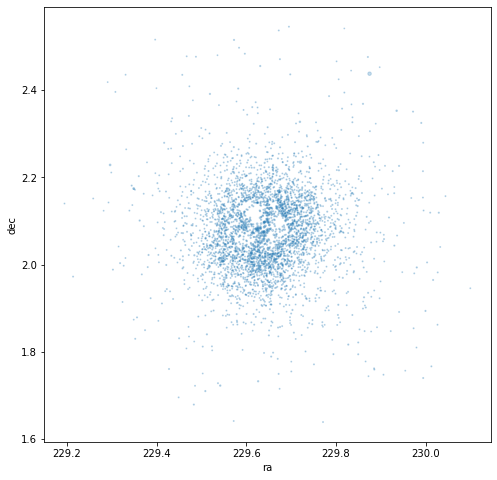
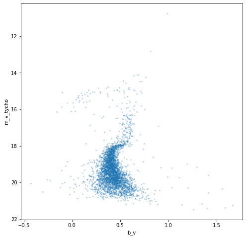
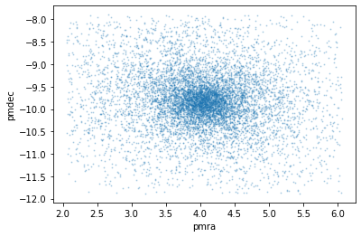
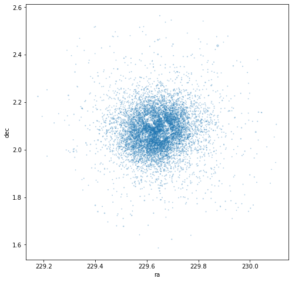
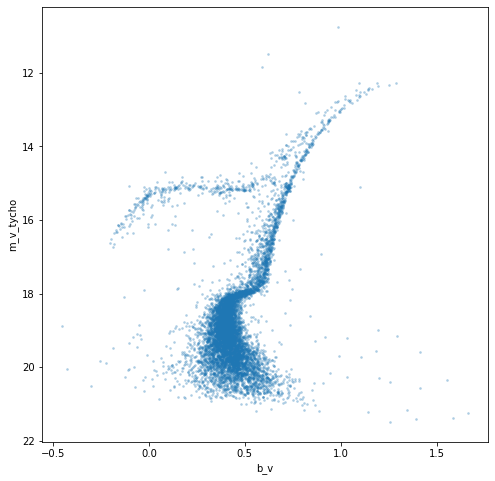

How to produce a CMD of a globular cluster
==========================================

Globular clusters are very old, very far away and contain a **lot** of
stars. Let's use clusterpluck to generate a pretty and interesting
globular cluster CMD.

.. code:: ipython3

    import clusterpluck as cp
    from clusterpluck.gaia import Refine, Info, Plotting

.. parsed-literal::

    Created TAP+ (v1.2.1) - Connection:
    	Host: gea.esac.esa.int
    	Use HTTPS: True
    	Port: 443
    	SSL Port: 443
    Created TAP+ (v1.2.1) - Connection:
    	Host: geadata.esac.esa.int
    	Use HTTPS: True
    	Port: 443
    	SSL Port: 443
    

Let’s look at a big, bright cluster called M5 in the constellation
Serpens using the simple ``search_name()`` method.

.. code:: ipython3

    cluster = cp.search_name('M5')
    t = Refine.load(cluster)

.. parsed-literal::

    Number of stars: 3823
    RA: 15 18 33.22 Dec: +02 04 51.7 Rad: 0.5
    PM_RA: 4.06 PM_Dec: -9.89 PM_Rad: 2
    Distance range: 210 pc to 3146 pc
    

That’s a lot of stars! Time to try some plots and see what we’ve got.

.. code:: ipython3

    Refine.pm_plot(t)

.. image:: img/04_Glob_Cluster_5_0.png

.. code:: ipython3

    Refine.map(t)

Well there is the cluster bang on target. The star map shows there are
some missing patches in the middle, probably because Gaia can’t separate
the stars in the very densely packed core. Still, there’s plenty to work
with.

.. code:: ipython3

    Plotting.cmd2(t)

There’s an interesting CMD. We can see the *red giant branch* curving
away from the main sequence at the bottom. It moves upwards and then
seems to move to the left. It looks like we can see some features but
they’re not really clear.

Perhaps we can improve this.

Let’s put the same search criteria as returned above but make the
distance range much wider. These clusters lie far away (> 10,000 pc) and
Gaia struggles with parallaxes of stars further than 2000 pc. Best we
try and include as many stars as we can.

Note, as long as we keep the below argument order we can just enter
strings and numbers.

- search(ra, dec, radius, pmra, pmdec, pm_r, d_near, d_far)

.. code:: ipython3

    cluster = cp.search('15 18 33.22', '+02 04 51.7', 0.5, 4.06, -9.89, 2, 1, 100000)
    t = Refine.load(cluster)

.. parsed-literal::

    Number of stars: 8380
    RA: 15 18 33.22 Dec: +02 04 51.7 Rad: 0.5
    PM_RA: 4.06 PM_Dec: -9.89 PM_Rad: 2
    Distance range: 1 pc to 100000 pc
    

OK. That’s even more stars. Took a while longer to search as well.
Surely they can’t all be in the cluster?

.. code:: ipython3

    Refine.pm_plot(t)

.. code:: ipython3

    Refine.map(t)

The proper motion and star map plots suggest almost all of the stars
belong to the cluster!

Perhaps the best test will be plotting the CMD again…

.. code:: ipython3

    Plotting.cmd2(t)

Well that answers the question. There are a few outliers but basically
*all* of the stars fit the cluster’s CMD. The plot also has a lot more
detail. The *horizontal branch* is now clear to the left and has a
strange downward turn to it and the *asymptotic giant branch* is visible
above the red giant branch.

You can compare this to the CMD published on Wikipedia
`here <https://upload.wikimedia.org/wikipedia/commons/c/c9/M5_colour_magnitude_diagram.png>`__.
